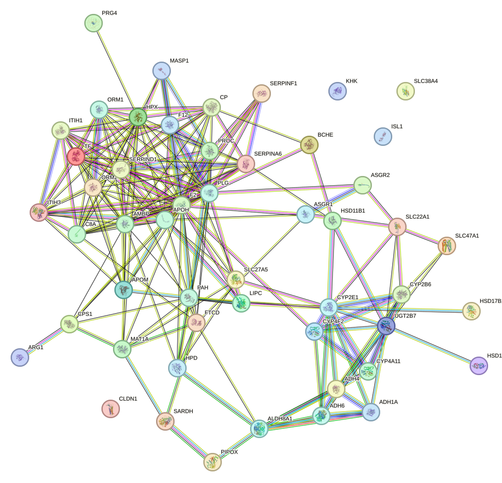
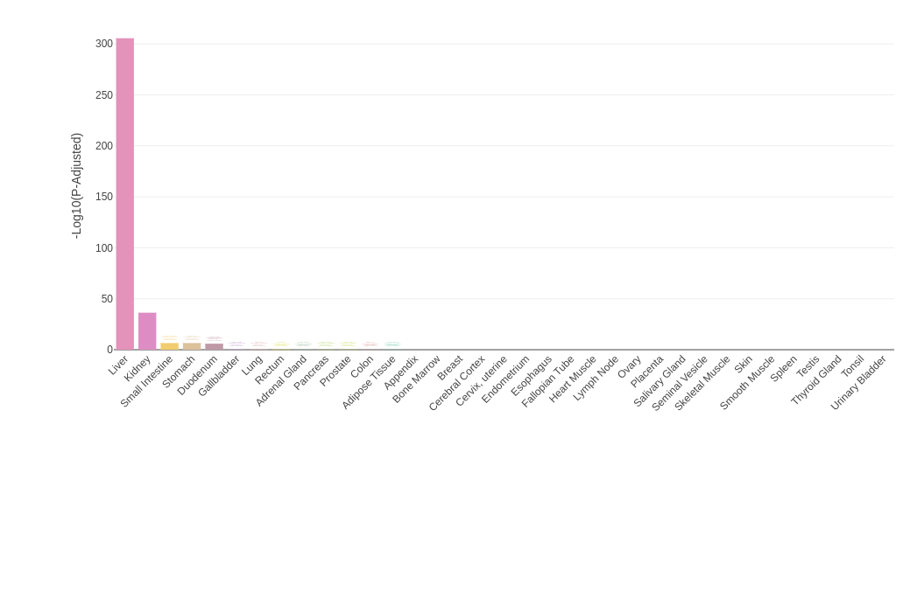
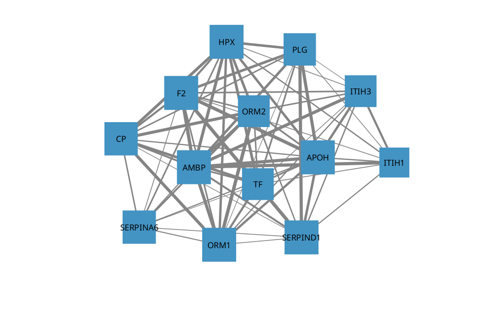
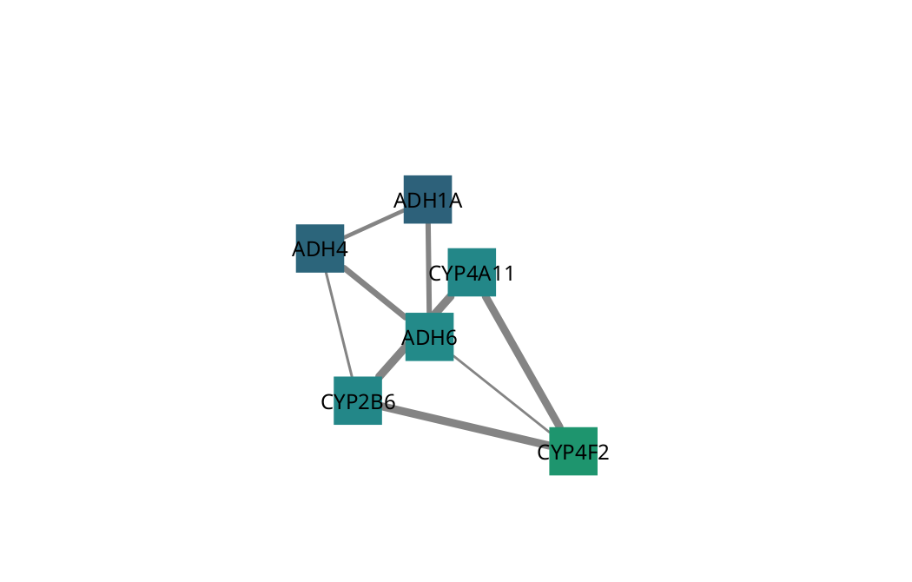

```{r setup, include=FALSE}
knitr::opts_chunk$set(echo = TRUE)

# Load Libraries
library(knitr)
library(DESeq2)
library(pheatmap)
library(RColorBrewer)
library(ggplot2)
library(readxl)
library(tibble)
library(edgeR)
library(dplyr)
library(TissueEnrich)
library(tidyverse)
library(biomaRt)
library(writexl)
library(png)
library(tinytex)
library(bookdown)
```

```{r body, message=FALSE, warning=FALSE, include=FALSE}
setwd("~/Documents/binf694/R_projects/BINF694_MainProject")

## Load Count Data
liver_a_counts <- read.table(file="Project 1/data/liver_a.s.count.txt", sep = "\t", header = T, row.names=1)
liver_c_counts <- read.table(file="Project 1/data/liver_c.s.count.txt", sep = "\t", header = T, row.names=1)
liver_d_counts <- read.table(file="Project 1/data/liver_d.s.count.txt", sep = "\t", header = T, row.names=1)
stomach_a_counts <- read.table(file="Project 1/data/stomach_a.s.count.txt", sep = "\t", header = T, row.names=1)
stomach_3b_counts <- read.table(file="Project 1/data/stomach_3b.s.count.txt", sep = "\t", header = T, row.names=1)
stomach_3a_counts <- read.table(file="Project 1/data/stomach_3a.s.count.txt", sep = "\t", header = T, row.names=1)
names(liver_a_counts)[1] <- "count"
names(liver_c_counts)[1] <- "count"
names(liver_d_counts)[1] <- "count"
names(stomach_a_counts)[1] <- "count"
names(stomach_3b_counts)[1] <- "count"
names(stomach_3a_counts)[1] <- "count"

## Load Sample Info
sample_info <- read_excel("Project 1/data/masterData.xlsx", sheet = "sample_info")
sample_info <- sample_info[, 1:2] 
sample_info <- column_to_rownames(sample_info, var = colnames(sample_info)[1])

## Load Gene Info
gene_info <- read_excel("Project 1/data/masterData.xlsx", sheet = "gene_info")
gene_info <- dplyr::filter(gene_info, filter_selection == "YES")
gene_list <- gene_info$gene ## Combine Gene Lists

## Load Enrichment Results
enrichment_results <- read_excel("Project 1/finalDeliverables/results/enrichmentResults.xlsx", sheet = "ER_results")

## Create count matrix
count_matrix <- cbind(
  liver_a = liver_a_counts$count,liver_c = liver_c_counts$count,liver_d = liver_d_counts$count,
  stomach_a = stomach_a_counts$count,stomach_3a = stomach_3a_counts$count,stomach_3b = stomach_3b_counts$count
)
rownames(count_matrix) <- rownames(liver_a_counts)

## Creating a DESeqDataSet
dds <- DESeqDataSetFromMatrix(
  countData = count_matrix,
  colData = sample_info,
  design = ~ tissue
)
dds <- dds[rowSums(counts(dds)) >= 10, ]

# Run DESeq2 analysis
dds <- DESeq(dds)

res <- results(dds, contrast=c("tissue", "liver", "stomach"))
# Sort results by adjusted p-value
res_ordered <- res[order(res$padj), ]
summary(res)

vsd <- vst(dds, blind=FALSE)
```

# Abstract
The human liver and stomach represent two distinct filtering systems with complementary functions in the body. While the liver filters blood and performs metabolic detoxification, the stomach filters ingested materials through physical and chemical processes. This study aimed to characterize the differences between these organs to better understand their specialized functions. RNA-sequencing results were utilized from three biological replicates of each human liver and stomach tissues. Following quality assessment, adapter trimming, and alignment to the human reference genome (GRCh38.p14-ensembl), differential gene expression analysis was conducted using DESeq2. Principal component analysis revealed extreme separation along PC1 (explaining 95% of variance), confirming fundamentally different expression profiles between tissues. The top differentially expressed genes included liver-specific markers involved in detoxification pathways (ALB, SERPINC1, CYP family) and stomach-specific genes related to mucosal protection (MUC5AC, GKN1, TFF1). Hierarchical clustering demonstrated two distinct gene expression patterns with minimal overlap between tissues. These findings support our hypothesis that liver and stomach tissues exhibit distinctive gene analysis signatures reflecting their specialized filtering functions, with liver expressing higher levels of detoxification and metabolic pathway genes, while stomach shows elevated expression of genes related to acid production, mucus secretion, and digestive processes.

## AI Aknowledgement

This research utilized Claude 3.7 Sonnet, a large language model developed by Anthropic. Claude was prompted with the initial parameters of the research including the Abstract, Hypothesis, and Results. Claude assisted in adding visualization recommendations, and was used as a tool to debug code. As a powerful language model, Claude assisted in manuscript structuring and text synthesization, acting as an editor to written text and synthesized complex information into coherent text narratives; these narratives were not directly utilized but provided input into the written text via the author's own interpretation.

The author carefully reviewed and validated all AI contributions to ensure scientific accuracy. All analyses, interpretations, and conclusions represent the author's independent judgment and responsibility.

\newpage
# Introduction
The human body is comprised of diverse organs with specialized functions that are ultimately reflected in their gene expression profiles. Of these, the liver and stomach represent two distinct but complementary filtering systems that process or "filter" what enters the body. Gene expression analysis allows us to see these underling specialized functions and how they relate to one another.

The liver serves as the body's primary detoxification center, filtering blood. It synthesizes essential proteins including albumin and clotting factors [IPR009271](https://www.ebi.ac.uk/interpro/entry/InterPro/IPR009271/). Moreover, the liver helps to maintain glucose homeostasis through glycogen storage and gluconeogenesis [**(Rui, 2014)**](#Rui2014). These functions require coordinated expression of genes encoding cytochrome P450 enzymes, transporters like ABCC2, and serum proteins such as alpha-1 antitrypsin (AAT).

In contrast, the stomach functions as the initial filtering station for ingested materials. It specializes in mucus secretion and digestive functions. The GKN family (GKN1, GKN2) are expressed in gastric epithelium cells [**(Yoshikawa 2000)**](#Yosh2000). Digestive enzyme genes (PGC, LIPF) contribute to the primary digestive function. The gastric mucosa is protected from autodigestion by a specialized mucus layer, with MUC5AC being a predominant mucin that shields epithelial cells from the harsh acidic environment [**(Song S 2011)**](#Song2011_2).

With this we can hypothesizes that the liver and stomach will show differentially expressed gene patterns reflecting their specialized filtering functions, with the liver expressing higher levels of detoxification and metabolic pathway genes, while the stomach will show elevated expression of genes related to acid production, mucus secretion, and initial digestive processes. Through RNA-sequencing analysis of three biological replicates from each tissue, we aim to characterize these distinct signatures and identify the key molecular pathways that distinguish these filtering organs.

## Hypothesis
The liver and stomach will show differentially expressed gene patterns reflecting their specialized filtering functions. The liver will express higher levels of detoxification and metabolic pathway genes; while the stomach will show elevated expression of genes related to acid production, mucus secretion, and initial digestive processes.

\newpage
# Methods
Three biological replicates each of human liver (samples a, c, and d) and stomach (samples 1a, 2a, and 3b) tissues were selected for comparative gene expression analysis. The analysis aimed to test our hypothesis that liver and stomach tissues would show differentially expressed gene patterns reflecting their specialized filtering functions, with the liver expressing higher levels of detoxification and metabolic pathway genes, while the stomach would show elevated expression of genes related to acid production, mucus secretion, and initial digestive processes.

[**Claude 3.7 Sonnet - AI Reference**](https://claude.ai/share/5142901c-bf60-4d6b-a944-a95c549ac000)

## Qualitiy Control
The first step was to perform quality control analysis on the 6 tissue samples using FastQC. The selected samples were analyzed using version 0.11.9 of FastQC. Quality metrics including per base sequence quality, per sequence quality scores, sequence duplication levels, adapter content, and k-mer content were evaluated.

#### Liver Tissue Analysis

Overall the three liver samples analyzed expressed similar results. There were no concerns with the results from samples a and c, however, with sample d there is some concern with a substantial proportion of bases had quality scores below 28, which led to higher filtering rates during trimming.

#### Stomach Tissue Analysis

Similar to the liver tissues, two stomach samples (1a and 2a) showed satisfactory quality metrics. Sample 3b exhibited quality concerns with a larger proportion of bases below quality score 28, resulting in more aggressive filtering during trimming.

## Trimming
After it was determined that we can proceed with further analysis of the provided samples, FastQC was utilized to trim the samples.

**Parameters:**
```
MIN_LEN=40; the minimum sequence length
MIN_QUAL=28; the minimum quality score threshold
```

These parameters were selected to ensure that the trimmed sequences would meet the quality standards for downstream analysis.

```{r tab1_trimmingData, echo=FALSE}
trim_df <- read.csv("~/Documents/binf694/R_projects/BINF694_MainProject/Project 1/data/trimming_results.csv", header=TRUE)
kable(trim_df, caption = "Trimming Results | Table 1")
```

As expected, liver_d and stomach_3b had the highest proportion of sequences filtered out during this step, consistent with their lower initial quality metrics.

## Mapping
The trimmed sequences were then aligned to the human genome (GRCh38 GRCh38.p14-ensembl) using STAR version 2.7.11b. The mapping results were evaluated to assess the quality of the alignment and the overall mapping rate. SAMtools version 1.19.2 was then used to create the .bam files that will be used for counting.

```{r tab2_mappingData, echo=FALSE}
map_df <- read.csv("~/Documents/binf694/R_projects/BINF694_MainProject/Project 1/data/mapping_results.csv", header=TRUE)
kable(map_df, caption = "Mapping Results | Table 2")
```

The results from the mapping were not concerning. Overall, there was a higher mismatch rate for the stomach tissue samples. The may also be some quality issues with stomach_3b as the mapping rate of about 77.5% is pretty low. This may indicate some contamination in the sample as well as the multi mapping rate was much higher than the other tissue samples.

## Genome Visulization
Integrative Genomics Viewer (IGV) version 2.8.0 was used to visualize read alignments for genes of interest, allowing for inspection of exon coverage patterns and verification of expression differences between liver and stomach tissues. Analysis of the 6 tissue samples overlay on the human genome allowed use to see various stop codons and splice junctions.

## Read Counting
The next step was to count the reads from the aligned .bam files. The featureCounts function from HTSeq version 0.11.2 was used to count the 6 sorted and aligned .bam file provided by trimming and mapping. The reference annotation file used was, human genome GRCh38 GRCh38.p14-ensembl.

The featureCounts function was run with the following parameters:\
**Paramaters:**
```
mode intersection-nonempty
stranded no
format bam
type exon
idattr gene_name
```

## Differential Expression Analysis
Differential expression analysis was performed using DESeq2 version 1.48.0 in R version 4.5.0.

1. Via a created count matrix from the six tissue counts, a DESeqDataSet object was created \
2. Low-count genes (those with fewer than 10 reads across all samples) were filtered out \
3. Results were ordered by adjusted p-value and exported to a tab-delimited file \

## Understanding Sample Relationships
- PCA on variance-stabilized transformed data (vst) from DESeq2
- Sample distance matrix visualized as a heatmap with hierarchical clustering
- Multi-Dimensional Scaling (MDS) plot from edgeR to assess sample relationships
- Heatmaps of the top 50 differentially expressed genes across all samples
- MA plots to show the relationship between mean expression and log2 fold change
- Smear plots from edgeR to visualize differentially expressed genes

Additionally, selected marker genes from various research publications were analyzed separately and visualized in a heatmap with row-based scaling to highlight expression patterns.

### Gene Selection & Enrichment Analysis
To understand the biological significance of differentially expressed genes between liver and stomach tissues, we performed functional enrichment analysis using the Database for Annotation, Visualization, and Integrated Discovery (DAVID) 2021. The analysis was conducted on the top 400 differentially expressed genes, which were selected based on their adjusted p-value and log2 fold change.

The enrichment analysis included Gene Ontology (GO) terms for biological processes, cellular components, and molecular functions, as well as KEGG pathways and InterPro domains. The results were visualized using bar plots to highlight the most significantly enriched terms.

Further enrichment analysis was performed on the top 250 differentially expressed genes for each tissue type, as well as a pre-defined list of important genes related to liver and stomach functions. This analysis aimed to identify specific pathways and functions associated with each tissue type. Lastly, the results were compared to the top 50 differentially expressed genes to identify any commonalities or differences in enrichment patterns.

### Network Analysis
[**Claude 3.7 Sonnet**](https://claude.ai/share/40403cb7-b1b9-4c7c-8939-ea95407bc21b)

To understand the functional relationships and biological context of differentially expressed genes between liver and stomach tissues, we performed protein interaction network analysis. Utilizing the top 50 differentially expressed genes we can construct a network of protein-protein interactions (PPIs) to visualize the complex relationships between these genes. This approach allows us to identify key regulatory hubs, functional modules, and potential pathway connections that may not be apparent from gene lists alone. Our network analysis strategy employed both the STRING database for initial interaction mapping and Cytoscape for advanced visualization and topological analysis, as detailed in the following sections.

#### STRING

Protein-protein interaction networks for the top 50 differentially expressed genes were constructed using [**STRING database v12.0**](https://string-db.org). The top 50 DE genes were searched with both a minimum required interaction score of $0.400$ and a high minimum required interaction score of $0.700$.

#### Cytoscape

Cytoscape v3.10.3 was used to visualize the protein-protein interaction networks generated from STRING. The data exported from the STRING analysis was imported into Cytoscape, where the network was visualized and analyzed. The network was filtered to include only the top 50 differentially expressed genes, and the edges were colored based on the type of evidence supporting the interactions. MCODE version 2.0.3 was used to identify functional modules within the network, allowing for the exploration of specific gene clusters and their associated biological functions. These identified clusters were broken down and lead to the identification of key features of the liver tissue functions.

\newpage
# Results
Following the quality control and mapping steps, we proceeded with differential expression analysis using DESeq2. The analysis revealed distinct gene expression patterns between liver and stomach tissues, supporting our hypothesis that these organs exhibit specialized filtering functions. The results were visualized using various methods, including PCA, heatmaps, and enrichment analysis, to provide insights into the biological significance of the differentially expressed genes.

## Sample Relationship
The first step in the analysis was to visualize the relationships between the samples using PCA and a heatmap. The Principle component analysis (PCA) plot shows the distribution of samples in a two-dimensional space based on their gene expression profiles. The samples are colored by tissue type (liver or stomach), allowing for easy identification of clustering patterns.

As seen in [**Figure 1**](#fig1) 95% of the variance in the data is explained by the first principal component (PC1), which separates the liver and stomach samples. The second principal component (PC2) captures a smaller amount of variance (2%) and does not show a clear separation between the two tissue types. The large proportion of variance explained by PC1 suggests there are strongly differentially expressed genes between these tissues, which should provide rich material for pathway and functional analysis. This is consistent with the expected biological differences between these organs, with liver specialized for blood filtration/detoxification and stomach for food processing.

The PCA plot clearly shows that the liver and stomach samples cluster separately, indicating distinct gene expression profiles. The liver samples (liver_a, liver_c, and liver_d) are grouped together, while the stomach samples (stomach_a, stomach_3a, and stomach_3b) form a separate cluster. This separation supports our hypothesis that these tissues exhibit differentially expressed gene patterns reflecting their specialized filtering functions.

Next we will use a heatmap in [**Figure 2**](#fig2) to visualize the clustering of samples by tissue type. This heatmap shows a hierarchical clustering of your six samples based on their gene expression profiles after variance stabilizing transformation. The numerical values represent Euclidean distances between samples, with darker blue indicating greater similarity (smaller distance).

Observations to note:

- There are two defined clusters corresponding to each tissue type.
- With-in the both clusters for liver and stomach there is a high similarity to each other respectively.
- Overall, the distances between liver and stomach sample are much larger, indicating substantial differences between tissue type

This visualization strongly supports the experimental design. The clear separation between liver and stomach samples confirms that tissue-specific gene expression patterns are the dominant source of variation in your dataset, which aligns with the hypothesis about the distinct filtering functions of these organs.

## Differential Expression Analysis
Looking specifically into gene expression in terms of the different tissue types. The DESeq2 analysis was utilized to create a heatmap that shows the top 50 differentially expressed genes between liver and stomach tissues. [**Figure 3**](#fig3) displays normalized expression values for the 50 most significantly differentially expressed genes.

Pretty much all of the top genes were more directly associated with liver specific functions. Some of the liver functions highlighted by these genes were detoxification enzymes, lipid metabolism, and metabolic enzymes.

One gene that stands out is 'SERPINF1'. The gene encodes a protein PEDF known for being an potent inhibitor of angiogenesis a process of forming new blood vessels from existing blood vessels. There was no found intuition as to why this result may have been common between the tissues. There is plenty of research on the impact of SERPINF1, such as impact to tumor progression[**(Song L. 2011)**](#Song2011_1).


The next step was to determine the top genes differencially expressed for each tissue type. The goal here is to determine if there are any gene similarly expressed genes based on the top genes for each tissue. This will help shed more light on the top expressed genes from stomach tissue samples because overall there was less differentially expressed genes for this type.

To learn more about the tissue specific genes, using the log2FoldChange less than or greater than $0$ we can filter the genes related to each tissue. Moreover, [**Figure 4**](#fig4) shows this filter selection by creating a separation between the top differentially expressed genes for each tissue type and mapping them to their corresponding tissue type and the opposing tissue type.

The heatmap continues to confirm the hypothesis of the distinct "filtering" function differences of the liver and stomach. There are two distant clusters once again with no specific gene showing expression in both tissue type. The top right (in red for stomach) cluster represents that of stomach related genes. The bottom left (in green for liver) cluster represents that of genes are liver related. The heatmap shows that there is very few overlap in expression between the two tissue types.

**Liver-Specific Genes:**\
- Plasma Proteins:\
  - ALB: Albumin, the most abundant protein in blood plasma, produced almost exclusively by the liver \
  - SERPINC1: Antithrombin, a serine protease inhibitor that regulates blood coagulation \
  - HP: Haptoglobin, a protein that binds free hemoglobin to prevent kidney damage \
- Detoxification Enzymes:\
  - CYP1A2: Cytochrome P450 1A2, an enzyme involved in drug metabolism and detoxification \
  - UGT2B4: UDP-glucuronosyltransferase 2B4, an enzyme that conjugates drugs and xenobiotics for excretion \

**Stomach-Specific Genes:**\
- Digestive Enzymes:
  - LIPF1: Lipase, an enzyme that breaks down fats \
  - PGC: Pepsinogen C, an inactive precursor of pepsin, a digestive enzyme \
- Mucosal Protection:
  - MUC5AC: Mucin 5AC, a gel-forming mucin that protects the gastric epithelium \
  - GKN1: Gastrokine 1, a protein involved in gastric mucosal protection \
  
Although there is little to no overlap in expression between the two tissue types, some commonalities between functions are present. One being the liver and stomach both have genes that are involved in the detoxification process. The liver is known for its detoxification role, while the stomach has a more specialized function in processing ingested materials.

Next, a more targeted approach was taken to use a pre-defined list of important genes related to each tissue type. These genes were taken from a various of research publications based on their importance in the various functions of their respective organ. These list of pre-selected genes can be found in [**Table 3**](#table3) .

Using these genes one last heatmap was created to see if there is any expression between even more specific genes. [**Figure 5**](#fig5) further highlights the lack of overlap in expression between the two tissue types. However, it does highlight the importance of some of the stomach functions as these genes were overall less differentially expressed in our analyses. The top right cluster represents that of stomach related genes. The bottom left cluster represents that of genes are the liver related. Once again we can see two distinct clusters. There is very few overlap in expression between the two tissue types.

Before stepping into enrichment analysis, it was necessary to select the top genes to use in the analysis. The top 400 differentially expressed genes were selected based on their adjusted p-value and log2 fold change. This selection was made to ensure that the most significant genes were included in the enrichment analysis, allowing for a more accurate representation of the biological processes and pathways associated with liver and stomach tissues. 

### Gene Selection
The analysis was performed on the top 400 differentially expressed genes, which were selected based on their adjusted p-value and log2 fold change.

```{r sortingExample, eval=FALSE, fig.height=9, fig.width=6.5, message=FALSE, warning=FALSE, include=TRUE}
# Get differentially expressed genes with adjusted p-value < 0.05
sig_genes <- res_ordered[!is.na(res_ordered$padj) & res_ordered$padj < 0.05,]

# Separate liver and stomach upregulated genes
liver_genes <- sig_genes[sig_genes$log2FoldChange > 0,]
stomach_genes <- sig_genes[sig_genes$log2FoldChange < 0,]
```

Other sets were used in the analysis as well. Two sets comprised of the top 250 genes related to their specific tissue were used. The results suggest that the liver and stomach have distinct functional roles, with the liver being more involved in detoxification and metabolic processes, while the stomach is more focused on digestive functions. Contributing to our hypothesis that the liver and stomach will show differentially expressed gene patterns reflecting their specialized filtering functions.

In [**Figure 12**](#fig12) the results from using [**(Jain 2018)**](#Jain2018) TissueEnrich were used to analyze the top 400 differentially expressed genes. The results were predominantly liver-related the second most common tissue was kidney, small intestine, and finally stomach tissue as the 4th option. These results lead to further selections of the top 250 differentially expressed genes for each tissue type.

## Enrichment Analysis
To understand the biological significance of differentially expressed genes between liver and stomach tissues, we performed functional enrichment analysis using DAVID. Analysis of the top differentially expressed genes revealed distinct functional signatures that align with the specialized filtering roles of each organ.


**The following enrichment results were obtained from the analysis of the top 400 differentially expressed genes:**\

### Gene Ontology Biological Process
As seen in [**Figure 6**](#fig6), blood coagulation, [web source](https://www.informatics.jax.org/go/term/GO:0007596), was the most significantly enriched process ($26$ genes, $6.6%$, $p=5.7 * 10^{-21}$), followed by xenobiotic metabolic process ($23$ genes, $5.8%$, $p=1.2 * 10^{-15}$), proteolysis ($34$ genes, $8.6%$, $p=9.2 * 10^{-8}$), and innate immune response ($24$ genes, $6.1%$, $p=6.1 * 10^{-4}$). These enriched pathways clearly reflect the liver's multifaceted filtering functions, including blood component regulation, detoxification, protein processing, and immunological surveillance.

### Gene Ontology Cellular Component
The most significantly enriched cellular component was blood microparicle ($44$ genes, $11.1%$, $p=8.88 * 10^{-40}$), followed by the extracellular space (119 genes, 30.6%, $p=3.14 * 10^{-35}$), and extracellular exosome ($123$ genes, $31.1%$, $p=2.9 * 10^{-30}$). The enrichment of genes associated with blood microparicles and exosomes further emphasizes the liver's function in maintaining blood homeostasis and detoxifying harmful substances. The top ten results can be viewed in [**Figure 7**](#fig7).

### Gene Ontology Molecular Function
The most significantly enriched molecular function was serine-type endopeptidase inhibator activity ($21$ genes, $5.3%$, $p=2.7 * 10^{-14}$), followed by endopeptidase activity ($13$ genes, $3.3%$, $p=2.6 * 10^{-11}$), and serine-type endopeptidase activity ($22$ genes, $5.5%$, $p=1.5 * 10^{-10}$). These top three molecular functions are all related to proteolysis, which is a key function of the liver in processing and regulating blood proteins. [Source](https://www.britannica.com/science/proteolysis). The top ten results can be viewed in [**Figure 8**](#fig8).

### KEGG Pathway Analysis
The most significantly enriched pathways can be seen in [**Figure 9**](#fig9). The first being metabolic pathways ($130$ genes, $32.8%$, $p=5.54 * 10^{-32}$), highlighting the liver's central role in metabolism. This was followed by complement and coagulation cascades ($36$ genes, $9.1%$, $p=5.57 * 10^{-31}$), which aligns with the liver's function in blood protein homeostasis. Particularly notable was the enrichment of pathways directly related to the liver's detoxification role, including bile secretion ($24$ genes, $6.1%$, $p=1.04 *10{-15}$), and drug metabolism - cytochrome P450 ($19$ genes, $4.8%$, $p=2.87* 10^{-12}$).

### Interpro
The most significantly enriched protein domain family was the Sushi/SCR/CCP superfamily ($17$ genes, $4.3%$, $p=1.61* 10^{-14}$), followed by the Sushi/SCR/CCP domain ($16$ genes, $4.0%$, $p=2.35*10^{-13}$). These domains, also known as Short Consensus Repeats or Complement Control Protein modules, are characteristic structural features of complement regulatory proteins. The significant enrichment of this domain family aligns with our GO enrichment results showing complement activation and innate immune response as key liver functions. The top ten results can be viewed in [**Figure 10**](#fig10).


**The following enrichment results were obtained from the analysis of the top 250 differentially expressed genes for stomach tissue:**\

### Gene Ontology Biological Process
The most significantly enriched biological process was O-glycan processing ($9$ genes, $3.6%$, $p=1.2 * 10^{-8}$), followed by protein O-linked glycosylation ($9$ genes, $3.6%$, $p=1.0 * 10^{-6}$), and epithelil cell morphogenesis ($5$ genes, $2.0%$, $p=4.1 * 10^{-5}$).

### KEGG Pathway Analysis
The important pathway to highlight here is the metabolic pathway ($35$ genes, $14.1%$, $p=3.8 * 10^{-4}$). This is a key pathway for the stomach as it is involved in the digestion and absorption of nutrients. The other pathways were not as significant as those seen in the liver tissue.


In conclusion, these enrichment analysis results provide compelling evidence supporting our hypothesis. The liver's gene analysis reveals blood and chemical filtering system, with emphases on gene expression involved in detoxification, metabolism, and hemostasis. In contrast, the stomach's gene expression pattern reflects its role in food processing through acid production, mucus secretion, and initial digestive functions. These distinct molecular signatures underscore the specialized nature of these organs' filtering mechanisms, validating our initial hypothesis about their functional differentiation.

Furthermore, there is enough evidence to suggest further analysis in the gene expression of liver and kidney tissue. Further research could lead to more insights into the filtering functions of these organs, by comparing gene expression patterns between these two organs, we may gain a deeper understanding of their complementary functions in maintaining homeostasis.

\newpage
## Network Analysis
There are several key observations from the network analysis. Firstly, the network, as seen in [**Figure 11**](#fig11), has a highly interconnected cluster with a large amount of blood proteins, aligning with that of the liver's filtering function. This cluster includes genes such as APOH, SERPIND1, and F2, which are involved in blood coagulation and detoxification processes. The presence of these genes in the network highlights the liver's role in maintaining blood homeostasis and detoxifying harmful substances. These result are similar to that of the enrichment analysis as blood coagulation presented as the most significant biological process in our top 400 differentially expressed genes.

This cluster was viewed via MCODE in Cytoscape and can be seen as a cluster in [**Figure 13**](#fig13). As seen in the enrichment analysis blood coagulation was the most significantly enriched process and this aligns with th cluster identified here. The genes such as F2, PLG, SERPIND1, and APOH all play an import role in several proteins involved in blood clotting. When you look at the INTERPRO results, the top protein domain familys were the Sushi/SCR/CCP family containing APOH. Then further down the list the Serpin family was also present. This is a family of proteins that are known to inhibit serine proteases, which are involved in blood coagulation.

Another clustered identified was [**Figure 14**](#fig14). One identified family is ADH4, ADH6, ADH1A all contributing to alcohol metabolism the other being CYP2B6, CYP4A11, and CYP4F2 all contributing to drug metabolism. The presence of these genes in the network further supports the liver's specialized filtering role in processing and detoxifying various substances. This aligns with the KEGG Pathway Drug Metabolism - Cytochrome P450, which was one of the most significantly enriched pathways in our analysis.

## Results Summary
The liver and stomach are two distinct filtering organs with specialized functions in the human body. The liver is primarily responsible for detoxifying blood and synthesizing essential proteins, while the stomach plays a crucial role in food processing and digestion. The results from the various analyses conducted in this study provide compelling evidence supporting our hypothesis that these organs exhibit differentially expressed gene patterns reflecting their specialized filtering functions. The top genes identified were strongly associated with liver functions, this highlights the importance for look further into stomach specific pathways.

\newpage
# Discussion
This study set out to test the hypothesis that liver and stomach tissues would show differentially expressed gene patterns reflecting their specialized filtering functions, with the liver expressing higher levels of detoxification and metabolic pathway genes, while the stomach would show elevated expression of genes related to acid production, mucus secretion, and initial digestive processes. Our gene expression analysis has revealed distinct molecular signatures that strongly support this hypothesis and provide novel insights into the specialized filtering mechanisms of these organs.

## Methodological Evaluation / Limitations
The use of three biological replicates for each tissue type provided statistical robustness for our differential expression analysis, as evidenced by the clear separation in PCA analysis and the high statistical significance of our enrichment results. The application of DESeq2 for differential expression analysis, combined with comprehensive pathway analysis using DAVID, allowed for a thorough characterization of the functional differences between these tissues.

However, several limitations should be acknowledged. Firstly, the quality concerns with liver_d and stomach_3b samples noted in the QC analysis may have introduced some variability in our results. While these samples met the minimum quality thresholds for inclusion, the higher filtering rates during trimming may have affected the detection of low-abundance transcripts. Additional biological replicates or more stringent quality control could strengthen future analyses. 

Secondly, our differential expression analysis focused on the top differentially expressed genes, it is important to consider that other genes with lower fold changes may also play significant roles in liver and stomach functions. Future studies could benefit from a more comprehensive analysis of the entire transcriptome, including low-abundance transcripts and non-coding RNAs. More specifically, further analysis into the stomach tissue samples could lead to more insights into the filtering functions of this organ. By comparing gene expression patterns between these two organs, we may gain a deeper understanding of their complementary functions in maintaining homeostasis.

## Differential Expression Analysis
The differential expression analysis using DESeq2 revealed a clear separation between liver and stomach tissues, with distinct gene expression patterns supporting our hypothesis. The PCA plot and heatmap visualizations confirmed the strong clustering of samples by tissue type, indicating that the liver and stomach have fundamentally different gene expression profiles. The top 400 differentially expressed genes were predominantly liver-specific, with many involved in detoxification pathways, lipid metabolism, and blood protein regulation. In contrast, the stomach-specific genes were primarily associated with mucosal protection and digestive processes. Specifc analysis into stomach specific genes revealed that the stomach tissue samples had less differentially expressed genes overall. This suggests that the stomach may have a more specialized and less diverse set of functions compared to the liver, which is involved in a wide range of metabolic processes.

## Enrichment Results
Our enrichment analysis results showed a predominance of liver-related pathways. When we looked specific at the top stomach tissue differentially expressed genes, we could compare results to stomach-specific processes. This asymmetry could reflects the fundamental complexity difference between these two filtering organs. The liver serves as the body's central metabolic hub and primary detoxification center. This is evidenced by the extensive enrichment in pathways including xenobiotic metabolism, complement and coagulation cascades, lipid metabolism, and drug processing. In contrast, the stomach's filtering function is more specialized and focused the metabolic processes related to food digestion and initial processing. The stomach's gene expression profile is primarily centered around acid production, mucus secretion, and digestive enzyme synthesis, which are essential for its role in food processing. These process were not reflected in the enrichment results from the top 400 differentially expressed genes, but were evident in the enrichment analysis of the top 250 stomach related genes.


## Future Direction
Several promising directions emerge from this study. First, expanding the analysis to include additional filtering organs—such as kidneys and lungs—would provide a more comprehensive understanding of specialized filtering mechanisms across the body. This could help identify commonalities and differences in gene expression patterns and functional pathways among these organs.

As a brainstorming start to this furthered research, [**Claude 3.7 Sonnet - AI Brainstorming**](https://claude.ai/share/883da6f3-b64f-428b-8a11-4c270111f1e7) provide some areas of focus with some reference to existing research.

As referenced, [**(Satta 2022)**](#satta2022), there is a link between physiology and pathology in the kidney and lung. This could be a promising area of research to explore the relationship between filtering organs and their roles in disease processes. By comparing gene expression patterns between these organs, we may gain a deeper understanding of their complementary functions in maintaining homeostasis.

Lastly, further refinement of the differential expressed genes to utilize in enrichment analysis could lead to more insights into the filtering functions of these organs. Refining the selection criteria for differentially expressed genes, such as incorporating additional statistical methods or machine learning approaches, could enhance the robustness of the analysis and provide more accurate functional insights.

## Summary
This study has successfully demonstrated that liver and stomach tissues exhibit fundamentally distinct gene expression profiles that directly reflect their specialized filtering functions within the human body. The clear separation observed in our PCA and clustering analyses, combined with the pathway enrichment results, establishes a foundation for understanding organ-specific gene expression patterns that could inform future research. Moving forward, expanding this comparative approach to include other filtering organs such as kidneys and lungs, while incorporating more comprehensive gene expression analyses, will deepen our understanding of how the body's various filtering systems coordinate at the molecular level to maintain health and respond to environmental challenges.

\newpage
# References

B.T. Sherman, M. Hao, J. Qiu, X. Jiao, M.W. Baseler, H.C. Lane, T. Imamichi and W. Chang. DAVID: a web server for functional enrichment analysis and functional annotation of gene lists (2021 update). Nucleic Acids Research. 23 March 2022. doi:10.1093/nar/gkac194.<div id="sherman2022"></div>


Huang DW, Sherman BT, Lempicki RA. Systematic and integrative analysis of large gene lists using DAVID Bioinformatics Resources. Nature Protoc. 2009;4(1):44-57.<div id="Sherman2009"></div>


Rui L. (2014). Energy metabolism in the liver. Comprehensive Physiology, 4(1), 177–197. https://doi.org/10.1002/cphy.c130024 <div id="rui2014"></div>


Satta, E., Alfarone, C., De Maio, A., Gentile, S., Romano, C., Polverino, M., & Polverino, F. (2022). Kidney and lung in pathology: mechanisms and clinical implications. Multidisciplinary respiratory medicine, 17(2), 819. https://doi.org/10.4081/mrm.2022.819 <div id="satta2022"></div>


Song L, Huo X, Li X, Xu X, Zheng Y, Li D, Zhang J, Wang K, Wang L, Wu Z. SERPINF1 Mediates Tumor Progression and Stemness in Glioma. Genes. 2023; 14(3):580. https://doi.org/10.3390/genes14030580
<div id="Song2011_1"></div>


Song, S., Byrd, J. C., Guha, S., Liu, K. F., Koul, D., & Bresalier, R. S. (2011). Induction of MUC5AC mucin by conjugated bile acids in the esophagus involves the phosphatidylinositol 3-kinase/protein kinase C/activator protein-1 pathway. Cancer, 117(11), 2386–2397. https://doi.org/10.1002/cncr.25796
<div id="Song2011_2"></div>


Szklarczyk D, Kirsch R, Koutrouli M, Nastou K, Mehryary F, Hachilif R, Annika GL, Fang T, Doncheva NT, Pyysalo S, Bork P‡, Jensen LJ‡, von Mering C‡.
The STRING database in 2023: protein–protein association networks and functional enrichment analyses for any sequenced genome of interest.
Nucleic Acids Res. 2023 Jan 6;51(D1):D638-646.


Yoshikawa, Y., Mukai, H., Hino, F., Asada, K., & Kato, I. (2000). Isolation of two novel genes, down-regulated in gastric cancer. Japanese journal of cancer research : Gann, 91(5), 459–463. https://doi.org/10.1111/j.1349-7006.2000.tb00967.x
<div id="Yosh2000"></div>


Support from the University of Delaware Bioinformatics Data Science Core Facility (RRID:SCR_017696) including use of the BIOMIX and BioStore computational resources was made possible through funding from Delaware INBRE (NIGMS P20GM103446), NIH Shared Instrumentation Grant (NIH S10OD028725), the State of Delaware, and the Delaware Biotechnology Institute. <div id="biomix"></div>

\newpage
# Supportting Code & Resources

## Github Project
The complete project results and supporting code can be found [**linked here at github**](https://github.com/assmith23/Gene-Expression-of-Filtration-Process-in-Human-Liver-and-Stomach/tree/main).

### Data Files
- The complete differentially expression analysis results can be found [**linked here in the github project**](https://github.com/assmith23/Gene-Expression-of-Filtration-Process-in-Human-Liver-and-Stomach/blob/main/differentialExpressionAnalysis_results.xlsx).

## Scripts
The end to end script can be [**referenced here at the github project**](https://github.com/assmith23/Gene-Expression-of-Filtration-Process-in-Human-Liver-and-Stomach/blob/main/end2end.R).

## R Packages and Versions
- DESeq2 | Version 1.48.0
- pheatmap | Version 1.0.12
- RColorBrewer | Version 1.1.3
- ggplot2 | Version 3.5.2
- readxl | Version 1.4.5
- tibble | Version 3.2.1
- edgeR | Version 4.6.1
- dplyr | Version 1.1.4
- TissueEnrich | Version 1.28.0
- tidyverse | Version 2.0.0
- biomaRt | Version 2.64.0
- writexl | Version 1.5.4
- knitr | Version 1.50
- png | Version 0.1-8
- tinytex | Version 0.57
- imager | Version 1.0.3
- bookdown | Version 0.43

## Biomix
- FastQC | Version 0.11.9
- SAMtools | Version 1.19.2
- STAR | Version 2.7.11b
- HTSeq | Version 0.11.2
- Integrative Genomics Viewer (IGV) | Version 2.8.0

## Enrichment Analysis
- DAVID | Version 2021

## Web Softwares
- STRING | Version 12.0
- TissueEnrich | Jain A and Tuteja G (2018). TissueEnrich: Tissue-specific gene enrichment analysis. Bioinformatics , bty890, doi.org/10.1093/bioinformatics/bty890 . <div id="Jain2018"></div>

## Other Tools
- Cytoscape | Version 3.10.3
  - MCODE | Version 2.0.3
  
\newpage
## Pre-Selected Gene List

<div id="table3"></div>

```{r print_gene_list, echo=FALSE}
gene_info <- gene_info %>% filter(gene_info$filter_selection == "YES")
kable(gene_info[0:3], caption = "Pre-Selected Gene List | Table 3")
```

\newpage
# Figures

<div id="figures"></div>

<div id="fig1"></div>

```{r fig1_pca, echo=FALSE, fig.height=3, fig.width=6.5, message=FALSE, warning=FALSE}
## PCA Plot
vsd <- vst(dds, blind=FALSE)
plotPCA(vsd, intgroup="tissue") + 
  theme_minimal() +
  ggtitle("PCA of Liver vs Stomach Samples | Figure 1")
```

<div id="fig2"></div>

```{r fig2_heatmap, echo=FALSE, fig.height=5, fig.width=6.5, message=FALSE, warning=FALSE}
sampleDists <- dist(t(assay(vsd)))
sampleDistMatrix <- as.matrix(sampleDists)
colors <- colorRampPalette(rev(brewer.pal(9, "Blues")))(255)
pheatmap(sampleDistMatrix,
         clustering_distance_rows=sampleDists,
         clustering_distance_cols=sampleDists,
         col=colors,
         display_numbers=TRUE,
         main="Sample Distance Matrix | Figure 2")
```

<div id="fig3"></div>

```{r fig3_geneHeatmap, echo=FALSE, fig.height=9, fig.width=6.5, message=FALSE, warning=FALSE}
top_50_genes <- rownames(res_ordered)[1:50]  # Top 50 DE genes
top_gene_counts <- assay(vsd)[top_50_genes, ]
pheatmap(top_gene_counts,
         cluster_rows=TRUE,
         cluster_cols=TRUE,
         show_rownames=TRUE,
         annotation_col=data.frame(Tissue=sample_info$tissue, row.names=rownames(sample_info)),
         main="Top 50 Differentially Expressed Genes | Figure 3")
```
<div id="fig4"></div>

```{r fig4_geneHeatmap2, echo=FALSE, fig.height=9, fig.width=6.5, message=FALSE, warning=FALSE}
res_fil <- res[!is.na(res$padj), ]
significant_genes <- res_fil[res_fil$padj < 0.05, ]
liver_genes <- significant_genes[significant_genes$log2FoldChange > 0, ]
stomach_genes <- significant_genes[significant_genes$log2FoldChange < 0, ]
liver_genes_ordered <- liver_genes[order(liver_genes$log2FoldChange, decreasing = TRUE), ]
stomach_genes_ordered <- stomach_genes[order(stomach_genes$log2FoldChange, decreasing = FALSE), ]
liver_top <- rownames(liver_genes_ordered)[1:25]
stomach_top <- rownames(stomach_genes_ordered)[1:25]
selected_genes <- c(liver_top, stomach_top)
top_gene_counts <- assay(vsd)[selected_genes, ]
#rownames(top_gene_counts) <- selected_genes[rownames(top_gene_counts), "gene"]

gene_origin <- data.frame(
  Origin = ifelse(rownames(top_gene_counts) %in% liver_top, "Liver", "Stomach"),
  row.names = rownames(top_gene_counts)
)

pheatmap(top_gene_counts,
         cluster_rows=TRUE,
         cluster_cols=TRUE,
         show_rownames=TRUE,
         annotation_col=data.frame(Tissue=sample_info$tissue, row.names=rownames(sample_info)),
         annotation_row=gene_origin,
         cutree_rows = 2,
         gaps_row = 25,
         main="Differentially Expressed Genes | Figure 4",
         fontsize_row=8)
```

<div id="fig5"></div>

```{r fig5_geneHeatmap3, echo=FALSE, fig.height=9, fig.width=6.5, message=FALSE, warning=FALSE}
markers<- intersect(gene_list, rownames(count_matrix))
filtered_counts <- count_matrix[markers, ]
filtered_counts[is.na(filtered_counts)] <- 0
filtered_counts[is.infinite(filtered_counts)] <- 0
row_var <- apply(filtered_counts, 1, var, na.rm=TRUE)
filtered_counts <- filtered_counts[row_var > 0,]

# Create heatmap
pheatmap(filtered_counts,
         scale = "row",
         cluster_rows = TRUE,
         cluster_cols = TRUE,
         show_colnames = TRUE,
         fontsize_row = 8,
         annotation_col=data.frame(Tissue=sample_info$tissue, row.names=rownames(sample_info)),
         main = "Gene Expression by Selected Genes | Figure 5",
)
```

<div id="fig6"></div>

```{r fig6_enrichBP, echo=FALSE, fig.height=4, fig.width=8, message=FALSE, warning=FALSE}
# Create a bar plot for the top 10 enriched biological processes
enrich_bp <- enrichment_results %>%
  filter(category == "GOTERM_BP_DIRECT") %>%
  filter(run_file == "top400_total_DEG-DAVID") %>%
  arrange(desc(Count)) %>%
  head(10)

# Bar Chart
ggplot(enrich_bp, aes(x = reorder(Term, -Count), y = Count)) +
  geom_bar(stat = "identity", fill = "steelblue") +
  coord_flip() +
  labs(title = "Top 10 Enriched Biological Processes | Figure 6",
       x = "Biological Process",
       y = "Gene Count") +
  theme_minimal()
```

<div id="fig7"></div>

```{r fig7_enrichCC, echo=FALSE, fig.height=4, fig.width=8, message=FALSE, warning=FALSE}
# Create a bar plot for the top 10 enriched biological processes
enrich_bp <- enrichment_results %>%
  filter(category == "GOTERM_CC_DIRECT") %>%
  filter(run_file == "top400_total_DEG-DAVID") %>%
  arrange(desc(Count)) %>%
  head(10)

# Bar Chart
ggplot(enrich_bp, aes(x = reorder(Term, -Count), y = Count)) +
  geom_bar(stat = "identity", fill = "steelblue") +
  coord_flip() +
  labs(title = "Top 10 Enriched Cellular Component | Figure 7",
       x = "Cellular Component",
       y = "Gene Count") +
  theme_minimal()
```

<div id="fig8"></div>

```{r fig8_enrichMF, echo=FALSE, fig.height=4, fig.width=8, message=FALSE, warning=FALSE}
# Create a bar plot for the top 10 enriched Molecular functions
enrich_bp <- enrichment_results %>%
  filter(category == "GOTERM_MF_DIRECT") %>%
  filter(run_file == "top400_total_DEG-DAVID") %>%
  arrange(desc(Count)) %>%
  head(10)

# Bar Chart
ggplot(enrich_bp, aes(x = reorder(Term, -Count), y = Count)) +
  geom_bar(stat = "identity", fill = "steelblue") +
  coord_flip() +
  labs(title = "Top 10 Enriched Molecular Function | Figure 8",
       x = "Molecular Function",
       y = "Gene Count") +
  theme_minimal()
```

<div id="fig9"></div>

```{r fig9_enrichKEGG, echo=FALSE, fig.height=4, fig.width=8, message=FALSE, warning=FALSE}
# Create a bar plot for the top 10 enriched KEGG pathways
enrich_kegg <- enrichment_results %>%
  filter(category == "KEGG_PATHWAY") %>%
  filter(run_file == "top400_total_DEG-DAVID") %>%
  arrange(desc(Count)) %>%
  head(10)

# Bar Chart
ggplot(enrich_kegg, aes(x = reorder(Term, -Count), y = Count)) +
  geom_bar(stat = "identity", fill = "steelblue") +
  coord_flip() +
  labs(title = "Top 10 Enriched KEGG Pathways | Figure 9",
       x = "KEGG Pathway",
       y = "Gene Count") +
  theme_minimal()
```

<div id="fig10"></div>

```{r fig10_enrichInterpro, echo=FALSE, fig.height=4, fig.width=8, message=FALSE, warning=FALSE}
# Create a bar plot for the top 10 enriched Interpro
enrich_interpro <- enrichment_results %>%
  filter(category == "INTERPRO") %>%
  filter(run_file == "top400_total_DEG-DAVID") %>%
  arrange(desc(Count)) %>%
  head(10)
# Bar Chart
ggplot(enrich_interpro, aes(x = reorder(Term, -Count), y = Count)) +
  geom_bar(stat = "identity", fill = "steelblue") +
  coord_flip() +
  labs(title = "Top 5 Enriched Interpro | Figure 10",
       x = "Interpro",
       y = "Gene Count") +
  theme_minimal()
```


<div id="fig11"></div>

<center>


<div id="fig12"></div>

<center>


<div id="fig13"></div>

<center>


<div id="fig14"></div>

<center>